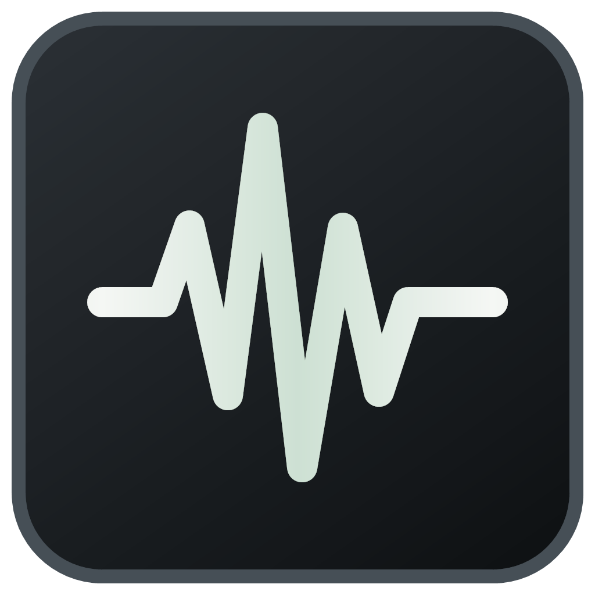

<p align="center">
  
</p>

<h1 align="center">VoicePrompt</h1>

<p align="center">
  <strong>Local, private, GPU-accelerated voice-to-text dictation for Windows</strong><br>
  Speak Slovenian or English — text lands in whatever app you're typing in.<br>
  Local by default. No audio leaves your machine. Optional text-only AI cleanup.
</p>

<p align="center">
  <a href="https://github.com/seNkoKG/VoicePrompt/releases/latest"></a>
  
  
  
  
</p>

---

## ✅ What it does

Hold **`F1`**, talk, release. ~0.5–1 second later the transcription is typed into the focused window — Notepad, Discord, browser chat, IDE, game chat. Works with **Slovenian and English**, with per-utterance auto-detection plus dedicated standard and slang Slovenian modes.

Optionally, VoicePrompt can fix spoken grammar or turn a rough transcript into a cleaner AI prompt before pasting it. This is disabled by default and never changes the local audio pipeline.

Measured on an RTX 5080:

| Model | VRAM while idle | Load time | Per 8s utterance | Slovenian quality |
|---|---|---|---|---|
| `large-v3-turbo` (fast) | ~2.2 GB | ~3 s | ~0.35 s | okay |
| **`large-v3` (accuracy)** | ~4 GB | ~5 s | ~0.6 s | **best** |

> Both run entirely locally on your GPU through **faster-whisper** (CTranslate2). The driving app is the open-source
> [`faster-whisper-dictation`](https://github.com/bhargavchippada/faster-whisper-dictation) daemon.

## 🏗️ Architecture

```text
 F1 hold
    |
    v
+----------------------+   +----------------------+   +----------------------+
| Hotkey listener      |-->| Windows audio        |-->| faster-whisper       |
| pynput global hook   |   | 16 kHz mono          |   | large-v3 CUDA fp16   |
| selected key consumed|   | live level meter     |   | language selection   |
+----------------------+   +----------------------+   +----------+-----------+
                                                                 |
                                                                 | transcript
                                                                 v
+----------------------+   +----------------------+   +----------------------+
| Focused application  |<--| Clipboard paste      |<--| AI cleanup (optional)|
| Chat, IDE, browser   |   | Ctrl+V, then restore |   | raw, grammar, prompt |
+----------------------+   +----------------------+   +----------------------+
```

- **Hold mode**: recording only while you hold the key → no accidental captures.
- **VAD filtering**: silence/speech detection chops dead air before decoding.
- **Prompt injection**: a Slovenian + English programming vocabulary biases decoding toward code terms (`pull request`, `null`, `async`, …).
- **Daemonized**: runs headless via `pythonw`, survives reboot via the Startup shortcut.

## 🚀 Download and install

Requirements: **64-bit Windows 11**, **Python 3.10+**, an **NVIDIA GPU with a current driver**, and roughly **10 GB of free disk space** for the runtime and model.

1. Open the [latest VoicePrompt release](https://github.com/seNkoKG/VoicePrompt/releases/latest) and download `VoicePrompt-v1.1.0-windows-x64.zip`.
2. Extract the ZIP, open PowerShell in that folder, and run:

```powershell
powershell -ExecutionPolicy Bypass -File .\install.ps1
```

The installer creates the private Python environment, installs the tested speech engine, applies the Windows integration fixes, installs the self-contained tray app, and creates desktop and Start Menu shortcuts. Open **VoicePrompt**, then hold **F1** to talk. The first start downloads the selected model (~3.1 GB for `large-v3`) once.

> The executable is not code-signed yet, so Windows may show an “unknown publisher” warning. Only run packages downloaded from this repository's official Releases page. The SHA-256 checksums are attached to every release.

### Build from source

```powershell
# 1. Create the venv and install the engine (requires Python 3.10+ and an NVIDIA GPU)
py -m venv "$env:USERPROFILE\.voice-typing\venv"
& "$env:USERPROFILE\.voice-typing\venv\Scripts\pip" install faster-whisper-dictation[local-gpu]

# 2. CUDA 12 DLLs (needed on driver 600+ / CUDA 13 UMD systems without a CUDA toolkit)
& "$env:USERPROFILE\.voice-typing\venv\Scripts\pip" install nvidia-cublas-cu12 nvidia-cudnn-cu12 nvidia-cuda-runtime-cu12 nvidia-cuda-nvrtc-cu12

# 3. Apply the Windows fixes (see "Patches")
powershell -ExecutionPolicy Bypass -File scripts\apply_patches.ps1

# 4. Build the self-contained Windows x64 tray UI (requires .NET SDK 10+)
powershell -ExecutionPolicy Bypass -File scripts\build_ui.ps1

# 5. Start Voice Typing — it runs in the system tray and auto-starts the daemon
.\ui\publish\VoicePromptTray.exe --tray
```

First start downloads the model (~1.6 GB turbo / ~3.1 GB full) into `~/.cache/huggingface/hub` — one-time.

## 🖥️ Tray UI (`ui/VoicePromptTray`)

A dark-themed Windows tray app (C# / .NET 10 WinForms) that manages the whole setup:

- **System tray** — runs minimized next to the clock; double-click the icon (or the desktop **Voice Typing Settings** shortcut) to open settings. The tray menu starts/stops/restarts the daemon and quits the app.
- **Recording overlay** — a small microphone and real audio waveform appears above the taskbar while the hotkey is held. It follows the active screen and never takes keyboard focus.
- **Hotkey recorder** — click the box, press **one key (F1, Space, 7…)** or a **combo (Ctrl+Shift+F1, Alt+Space…)**, Enter confirms, Esc cancels. Supports `hold` (press & hold to talk) or `toggle` modes.
- **AI text cleanup** — optionally fixes grammar or restructures rough speech into a clean AI prompt, with a strict deadline and original-text fallback.
- **All settings** — language (auto / Slovenian / Slovenian slang / English), decoding prompt, VAD threshold & timing, microphone (enumerated live) and sample rate, model (`large-v3` / `large-v3-turbo`), compute type, GPU/CPU, temperature, hotwords.
- **Save & Restart** writes the live config, keeps your comments, and restarts the daemon in one click.
- **Start with Windows** checkbox manages its own startup shortcut; the daemon auto-starts with the UI.

Rebuild after changes: `scripts\build_ui.ps1` (outputs `ui\publish\VoicePromptTray.exe`).

## ⚙️ Configuration

The tray UI edits the live config — `%LOCALAPPDATA%\faster-whisper-dictation\faster-whisper-dictation\config.toml`
(snapshot in this repo: [`config.toml`](config.toml)). Settings load at daemon start — the UI restarts it for you on Save.

| Key | Meaning | Example |
|---|---|---|
| `[hotkey] binding` | Global hotkey (single key or combo) | `"f1"`, `"ctrl+shift+f1"`, `"alt+space"` |
| `[hotkey] mode` | `hold` = press & hold; `toggle` = press once | `"hold"` |
| `[server] model` | Whisper model | `"Systran/faster-whisper-large-v3"` |
| `[server] language` | `""` = auto; `"sl-slang"` = mixed English/Slovenian retry | `"sl"`, `"en"` to pin |
| `[server] prompt` | Decoding context / vocabulary bias | mixed SI/EN code terms |
| `[voiceprompt] slovenian_slang` | Enables the mixed English/Slovenian retry profile | `true` / `false` |
| `[vad] threshold` | Speech sensitivity (0–1) | `0.6` |
| `[engine] compute_type` | `float16` GPU / `int8` CPU | `"float16"` |
| `[audio] device` | `""` = Windows default input (HyperX Quadcast) | `""` |

### Slovenian slang mode

Short colloquial Slovenian phrases can look like a third language to automatic detection. **Slovenian slang** keeps normal English and Slovenian detection, adds a compact vocabulary profile for forms such as `dej`, `lohk`, `kva`, `tko`, `tle`, `zdej`, `pol`, `ful`, and `štima`, and retries as Slovenian only when Whisper reports some other language. English is never reinterpreted by the retry. Your own decoding prompt and hotwords are preserved separately and restored when the profile is disabled.

### Optional AI cleanup

The **AI text cleanup** card supports three modes:

- **Off**: the default. No request, no per-utterance network or file access, and no added delay.
- **Grammar**: fixes grammar, punctuation, filler words, and false starts without answering the transcript.
- **Prompt**: turns rough speech into a concise, structured AI prompt while preserving requirements, names, code, numbers, and URLs.

The endpoint can be any OpenAI-compatible `/v1/chat/completions` service. For a private local setup, install [Ollama for Windows](https://ollama.com/download/windows), run `ollama pull qwen2.5:3b`, and keep the default endpoint and model. Ollama documents its [OpenAI-compatible endpoint here](https://docs.ollama.com/api/openai-compatibility). A cloud provider also works by entering its endpoint, model, and API key.

Only the completed transcript text is sent when cleanup is enabled; microphone audio stays local. Saved API keys are encrypted for the current Windows account. Live requests reuse one connection, cap the response size, wait at most 400–3000 ms (900 ms by default), and paste the untouched local transcript after any timeout or invalid response. The **Test** button can take up to six seconds because it also wakes a sleeping local model; this longer test allowance does not apply to live dictation.

## 🔧 Patches (required on Windows)

Nine Windows integration fixes ship in this repo — apply them **after every reinstall/upgrade**:

1. **`cli.py`** — `_pid_alive()` used `os.kill(pid, 0)`, which raises `OSError` (WinError 87) on Windows and broke `status` / `stop`. Now uses `OpenProcess` via ctypes.
2. **`typer.py`** — clipboard calls had no `argtypes`/`restype`, so 64-bit HANDLEs were truncated to 32 bits → access violations when pasting. All Win32 calls now declare their signatures.
3. **`engine/local.py` / `slang_retry.py`** — maps automatic modes correctly and lets `sl-slang` preserve English while retrying only third-language mistakes as Slovenian.
4. **`engine/local.py`** — logs detected language + confidence per utterance (auto-detect diagnostics).
5. **`engine/local.py`** — passes prompt, temperature, hotwords, and VAD controls to local faster-whisper. These settings otherwise have no effect in the upstream local engine.
6. **`daemon.py` / `meter.py`** — publishes recording state, microphone level, and live waveform samples through named shared memory, without a second audio capture or disk polling.
7. **`config.py`** — hotkey validation accepts single keys (letters, digits, `f1`–`f24`, `space`, `enter`, …) and combos, so the UI's recorder can save them.
8. **`hotkey/listener.py`** — selectively consumes the configured hotkey on Windows, so keys such as F1 do not also trigger browser help or application commands. Other keys and the app's injected transcription remain untouched.
9. **`typer.py` / `ai_rewriter.py`** — optionally cleans completed transcript text before the clipboard is opened, with a strict deadline and raw-text fallback.

Run: `powershell -ExecutionPolicy Bypass -File scripts\apply_patches.ps1`

## 🧪 Testing

The E2E harness simulates what a human does (no spoken voice needed):

- `tests/e2e_test.ps1` — opens a live text target window, presses the hotkey via `keybd_event`, plays an audio file through the speakers/microphone path, and proves the transcribed text lands there (timestamps the release→paste latency).
- `tests/bench_one.py` — model load time, VRAM delta, decode time per utterance.
- `tests/probe_devices.py` — enumerates PortAudio input devices.
- `tests/test_ai_rewriter.py` — exercises both cleanup modes, warm connection reuse, API authentication, response guards, strict timeouts, and raw fallback against a local mock provider.
- `ui/ConfigManager.Tests` — verifies the UI's comment-preserving config.toml editor (run: `dotnet run --project ui\ConfigManager.Tests`).

Verified end-to-end results (simulated): **hotkey → record → GPU transcribe → paste ≈ 0.8 s** after key release, with text matching the spoken source.

## 🩹 Troubleshooting

| Symptom | Cause / fix |
|---|---|
| `Library cublas64_12.dll is not found` | CUDA 12 DLLs not on PATH → install the `nvidia-*cu12` pip packages (Step 2); `run_daemon.pyw` prepends their `bin` dirs automatically |
| Nothing typed but recording starts | Transcription crashed → read `%USERPROFILE%\.voice-typing\daemon.log`; check `language = ""` (not `"auto"`) and patches applied |
| Hotkey does nothing in an elevated app or game | Windows can isolate higher-integrity input hooks → run Voice Typing at the same privilege level, or choose a binding the app does not reserve |
| Bad or slangy Slovenian accuracy | Select **Slovenian slang** to retry third-language mistakes and boost colloquial words while English remains automatic; keep `large-v3` for best accuracy |
| Mic not captured | Windows Settings → Privacy → Microphone → allow desktop apps (and make sure the Quadcast is the default input) |
| AI test fails or times out | Confirm the endpoint and model, start the provider, then click **Test** again; live dictation will paste the original transcript whenever cleanup is unavailable |

## 🖥️ Lifecycle

- **Auto-start on login**: `shell:startup` shortcut → `VoicePromptTray.exe --tray` (tray UI; starts the daemon itself)
- Desktop shortcuts: **Voice Typing Settings** (tray UI), **Start Voice Typing** / **Stop Voice Typing** (daemon only)
- Logs: `%USERPROFILE%\.voice-typing\daemon.log`
- State: daemon PID/status via `faster-whisper-dictation.exe status`
- UI prefs: `%APPDATA%\VoicePrompt\prefs.json`
- AI settings: `%APPDATA%\VoicePrompt\ai.json` (API key protected with Windows account encryption)

## 📜 Credits

- [faster-whisper-dictation](https://github.com/bhargavchippada/faster-whisper-dictation) — the dictation daemon (MIT)
- [faster-whisper](https://github.com/SYSTRAN/faster-whisper) — CTranslate2 whisper runtime (MIT)
- [OpenAI Whisper large-v3](https://github.com/openai/whisper) — the model (MIT)
- Logo artwork: generated for Voice Typing; multi-resolution Windows icon packaged by `scripts/make_icon.ps1`
