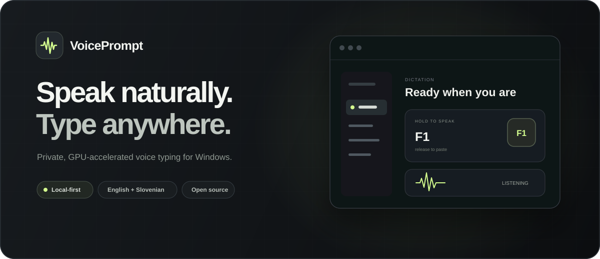

<p align="center">
  <a href="https://senkokg.github.io/VoicePrompt/">
    
  </a>
</p>

<p align="center">
  <strong>Local, private, GPU-accelerated voice-to-text dictation for Windows</strong><br>
  Speak Slovenian or English by default — or pin any Whisper language.<br>
  Local by default. Optional self-hosted recognition server and text-only AI cleanup.
</p>

<p align="center">
  <a href="https://github.com/seNkoKG/VoicePrompt/releases/latest"></a>
  <a href="https://senkokg.github.io/VoicePrompt/"></a>
  
  
  
  
</p>

---

## What it does

Hold **`F1`**, talk, release. Short transcription usually lands in the focused window in ~0.5–1 second — Notepad, Discord, browser chat, IDE, game chat. Long recordings pre-transcribe complete speech blocks while you talk, retain the full microphone stream for automatic recovery, and still paste exactly once after release. The default is fast **English + Slovenian Auto**, with dedicated standard and slang Slovenian modes. Users can also search and pin any of Whisper large-v3's 100 languages without downloading another model. Completed text can be kept in a bounded local recovery history, so a failed target application never costs the whole prompt.

Optionally, VoicePrompt can remove speech clutter, fix spoken grammar, or turn a rough transcript into a cleaner AI prompt before delivery. This is disabled by default and never changes the local audio pipeline.

Advanced users can explicitly switch recognition to a self-hosted OpenAI-compatible speech server. Local remains the default; the UI clearly warns when recorded audio would leave the PC and whether the connection is encrypted.

Measured on an RTX 5080:

| Model | VRAM while idle | Load time | Per 8s utterance | Slovenian quality |
|---|---|---|---|---|
| `large-v3-turbo` (fast) | ~2.2 GB | ~3 s | ~0.35 s | okay |
| **`large-v3` (accuracy)** | ~4 GB | ~5 s | ~0.6 s | **best** |

> Both run entirely locally on your GPU through **faster-whisper** (CTranslate2). The driving app is the open-source
> [`faster-whisper-dictation`](https://github.com/bhargavchippada/faster-whisper-dictation) daemon.

## Architecture

```text
 F1 hold
    |
    v
+----------------------+   +----------------------+   +----------------------+
| Hotkey listener      |-->| Windows audio        |-->| faster-whisper       |
| pynput global hook   |   | 16 kHz mono          |   | large-v3 CUDA fp16   |
| selected key consumed|   | live level meter     |   | language selection   |
+----------------------+   +----------------------+   +----------+-----------+
                                                                 |
                                                                 | transcript
                                                                 v
+----------------------+   +----------------------+   +----------------------+
| Focused application  |<--| Clipboard paste      |<--| AI cleanup (optional)|
| Chat, IDE, browser   |   | Ctrl+V, then restore |   | raw, grammar, prompt |
+----------------------+   +----------------------+   +----------------------+
```

- **Hold mode**: recording only while you hold the key → no accidental captures.
- **VAD filtering**: silence/speech detection chops dead air before decoding.
- **Personal vocabulary**: optional prompt and hotword fields can bias decoding toward names and exact technical terms without favoring one language by default.
- **Personal corrections**: explicit `misheard => intended` rules fix recurring names and terms locally before optional AI cleanup.
- **Daemonized**: runs headless via `pythonw`, survives reboot via the Startup shortcut.

## Download and install

Requirements: **64-bit Windows 11**, **Python 3.11+**, an **NVIDIA GPU with a current driver**, and roughly **10 GB of free disk space** for the runtime and model.

1. Open the [latest VoicePrompt release](https://github.com/seNkoKG/VoicePrompt/releases/latest) and download `VoicePrompt-v1.20.2-windows-x64.zip`.
2. Extract the ZIP, open PowerShell in that folder, and run:

```powershell
powershell -ExecutionPolicy Bypass -File .\install.ps1
```

The installer creates the private Python environment, installs the exact pinned speech runtime, applies the Windows integration fixes, installs the self-contained tray app, and creates desktop and Start Menu shortcuts. Open **VoicePrompt**, then hold **F1** to talk. The first start downloads the selected model (~3.1 GB for `large-v3`) once.

> The executable is not code-signed yet, so Windows may show an “unknown publisher” warning. Only run packages downloaded from this repository's official Releases page. The SHA-256 checksums are attached to every release.

### Build from source

```powershell
# 1. Create the venv and install the tested runtime (requires Python 3.11+ and an NVIDIA GPU)
py -m venv "$env:USERPROFILE\.voice-typing\venv"
& "$env:USERPROFILE\.voice-typing\venv\Scripts\pip" install --only-binary=:all: -r requirements.txt

# 2. Apply the Windows fixes (see "Patches")
powershell -ExecutionPolicy Bypass -File scripts\apply_patches.ps1

# 3. Build the self-contained Windows x64 tray UI (requires .NET SDK 10+)
powershell -ExecutionPolicy Bypass -File scripts\build_ui.ps1

# 4. Start VoicePrompt. It runs in the system tray and starts the daemon.
.\ui\publish\VoicePromptTray.exe --tray
```

First start downloads the model (~1.6 GB turbo / ~3.1 GB full) into `~/.cache/huggingface/hub` — one-time.

## 🖥️ Tray UI (`ui/VoicePromptTray`)

A responsive dark Windows tray app (C# / .NET 10 WinForms) that manages the whole setup:

- **Setup overview** — confirms runtime, hotkey, microphone, and recognition readiness at a glance, with direct recovery and support actions.
- **Three interface themes** — Graphite, Evergreen, and Ember apply instantly, stay local, and share the same restrained dark visual system.
- **Native dark window** — the Windows caption, frame, controls, and scroll surfaces match the app instead of flashing light chrome around it.
- **Focused workspaces** — Dictation, Audio, Engine & AI, Recovery, and System pages keep everyday setup simple while leaving expert controls available.
- **System tray** — runs minimized next to the clock; double-click the icon (or the desktop **VoicePrompt** shortcut) to open settings. The tray menu can instantly copy the latest saved transcript, start/stop/restart the daemon, and quit the app.
- **Recording overlay** — a small microphone and real audio waveform appears above the taskbar while the hotkey is held. It follows the active screen and never takes keyboard focus.
- **Live input test** — the Audio page shows quiet, good-signal, and very-loud microphone levels while the hotkey is held by reusing the overlay stream, with no second capture or extra GPU work.
- **Hotkey recorder** — click the box, press **one key (F1, Space, 7…)** or a **combo (Ctrl+Shift+F1, Alt+Space…)**, Enter confirms, Esc cancels. Supports `hold` (press & hold to talk) or `toggle` modes.
- **Flexible output** — paste directly into the focused app by default, or use **Copy only** when a target blocks synthetic paste and place the completed transcript manually.
- **Exact voice commands** — optionally speak a complete English or Slovenian command for a new line, new paragraph, bullet, undo, or cancel; normal sentences never trigger commands by substring.
- **Reusable snippets** — save up to 50 local text templates and insert one by its exact English or Slovenian spoken name, including multi-line content without AI or network delay.
- **Writing modes** — Verbatim stays fully local and instant; optional Clean, Grammar, and Prompt modes use a configured provider with a strict deadline, same-language instructions, and complete-original fallback.
- **Application profiles** — optionally override writing and output mode for an exact running-app executable; unmatched apps inherit global settings with no process lookup or added delay.
- **Recognition location** — keep the recommended local GPU engine, or explicitly use a self-hosted OpenAI-compatible transcription server with a no-audio health check and clear transport privacy status.
- **Fast long recordings** — pre-transcribes complete speech blocks on the existing model worker, preserves the full recording for recovery, and produces one ordered paste after release.
- **Recovery** — keeps a configurable 5–100 recent transcripts locally, compares the delivered result with the untouched original, and lets you copy either version. Audio is never stored.
- **Personal corrections** — applies approved phrase replacements deterministically with no model call or added network delay.
- **Portable language profiles** — exports or imports language, recognition context, hotwords, and personal corrections in a small JSON file. Profiles never contain API keys, transcript history, hotkeys, microphone names, or hardware settings.
- **Settings backup** — exports and review-first imports portable dictation, recognition, audio-detection, writing, recovery, correction, snippet, and application-profile settings without API keys, transcripts, microphone identity, startup state, or machine paths.
- **All settings** — language (English + Slovenian Auto, dedicated defaults, or any pinned Whisper language), decoding prompt, VAD threshold & timing, microphone (enumerated live) and sample rate, model (`large-v3` / `large-v3-turbo`), compute type, GPU/CPU, temperature, hotwords.
- **Guided recovery** — tested recognition defaults, live microphone refresh, Windows Sound Settings, privacy-safe performance statistics and copied diagnostics, and one-click log/config access.
- **Private update check** — manually checks GitHub with a three-second timeout. Stable is the default; Preview is explicit opt-in and also considers prereleases. It never checks in the background or installs silently.
- **Keyboard and accessibility** — predictable tab navigation, screen-reader names, `Ctrl+S` to save, `Esc` to hide, and `Ctrl+1` through `Ctrl+6` for page navigation.
- **Save & Restart** writes the live config, keeps your comments, and restarts the daemon in one click.
- **Start with Windows** checkbox manages its own startup shortcut; the daemon auto-starts with the UI.

Rebuild after changes: `scripts\build_ui.ps1` (outputs `ui\publish\VoicePromptTray.exe`).

## ⚙️ Configuration

The tray UI edits the live config — `%LOCALAPPDATA%\faster-whisper-dictation\faster-whisper-dictation\config.toml`
(snapshot in this repo: [`config.toml`](config.toml)). Settings load at daemon start — the UI restarts it for you on Save.

| Key | Meaning | Example |
|---|---|---|
| `[hotkey] binding` | Global hotkey (single key or combo) | `"f1"`, `"ctrl+shift+f1"`, `"alt+space"` |
| `[hotkey] mode` | `hold` = press & hold; `toggle` = press once | `"hold"` |
| `[server] url` | Compatible transcription server base URL; used only when engine type is `server` | `"http://localhost:8000"` |
| `[server] timeout` | Maximum server wait after releasing the hotkey | `60` |
| `[server] model` | Whisper model | `"Systran/faster-whisper-large-v3"` |
| `[server] language` | `""` = fast English/Slovenian Auto; otherwise pins one supported language | `"sl-slang"`, `"sl"`, `"en"`, `"de"`, `"ja"` |
| `[server] prompt` | Optional personal names / exact vocabulary bias | empty (language-neutral) |
| `[voiceprompt] slovenian_slang` | Saves the visible colloquial vocabulary profile | `true` / `false` |
| `[voiceprompt] buffered_transcription` | Pre-transcribes long speech blocks; full-audio fallback and one final paste | `true` |
| `[voiceprompt] output_mode` | `"paste"` types into the focused app; `"clipboard"` sends no paste shortcut | `"paste"` |
| `[voiceprompt] voice_commands` | Enables exact whole-utterance English and Slovenian commands | `false` |
| `[vad] threshold` | Speech sensitivity (0–1) | `0.6` |
| `[vad] max_speech_s` | Internal VAD segment size; not a recording cutoff | `180.0` |
| `[engine] type` | Private local engine or explicit compatible server | `"local"`, `"server"` |
| `[engine] compute_type` | `float16` GPU / `int8` CPU | `"float16"` |
| `[audio] device` | `""` = Windows default input (HyperX Quadcast) | `""` |

### English + Slovenian Auto

**Auto** is intentionally optimized for the two languages this app targets. The primary pass stays language-neutral, so English cannot inherit Slovenian slang examples and Slovenian cannot inherit English instructions. Confident English and Slovenian remain a single-pass path, keeping normal dictation fast.

Detected English and Slovenian are never replaced by a decode in the other supported language. If Whisper reports Finnish, Spanish, Latin, or another unrelated language, VoicePrompt uses the model's language probabilities and recent supported-language evidence to choose one bounded English or Slovenian recovery pass. The retry is accepted only when its transcript remains physically plausible and its decoder score is not materially worse. Slovenian recovery receives the compact colloquial profile for forms such as `dej`, `lohk`, `kva`, `tko`, `tle`, `zdej`, `pol`, `ful`, and `štima`.

### Additional languages

The Dictation page includes a searchable catalog of all 100 language codes supported by the installed Whisper large-v3 model. Choosing a result switches from bilingual Auto to a pinned recognition profile. Pinning bypasses language detection, keeps transcription in the spoken language, and does not invoke Whisper's separate translation task. The language profile is only a small setting: the existing multilingual model is reused, so there is no extra model download, network call, or GPU memory cost. Returning to **Auto** restores the tested English + Slovenian behavior.

### Compatible recognition server

Under **Engine & AI → Recognition engine**, choose **Compatible server**, enter the server base URL, set a bounded wait, and click **Test server**. The test performs only `GET /health`; it sends no audio, transcript, credentials, or request body. Actual dictation sends one completed WAV recording to `POST /v1/audio/transcriptions`, following the upstream OpenAI-compatible REST contract. Local processor, precision, and background pre-transcription controls are disabled because inference occurs on the server.

The default `http://localhost:8000` keeps audio on the same PC. Remote HTTPS is supported with a clear notice that completed recordings leave the computer. Remote unencrypted HTTP is allowed for deliberate trusted-network setups but receives a prominent warning. VoicePrompt does not add an authorization header, so use a server that is already protected by its own trusted network or reverse proxy. [WhisperLiveKit](https://github.com/QuentinFuxa/WhisperLiveKit) is the upstream-recommended compatible server; the base daemon documentation covers its [server mode](https://github.com/bhargavchippada/faster-whisper-dictation#engine-modes).

### Optional AI cleanup

The **AI text cleanup** card supports four writing modes:

- **Verbatim**: the default. No request, no per-utterance network or file access, and no added delay.
- **Clean**: removes obvious filler words and immediate repetitions, then repairs punctuation and capitalization without changing grammar, phrasing, tone, language, or concrete details.
- **Grammar**: conservatively fixes punctuation, capitalization, and obvious grammar without translating, paraphrasing, or removing wording.
- **Prompt**: turns rough speech into a concise, structured AI prompt while preserving requirements, names, code, numbers, and URLs.

The endpoint can be any OpenAI-compatible `/v1/chat/completions` service. For a private local setup, install [Ollama for Windows](https://ollama.com/download/windows), run `ollama pull qwen2.5:3b`, and keep the default endpoint and model. Ollama documents its [OpenAI-compatible endpoint here](https://docs.ollama.com/api/openai-compatibility). A cloud provider also works by entering its endpoint, model, and API key.

Only the completed transcript text is sent when cleanup is enabled; microphone audio stays local. Saved API keys are encrypted for the current Windows account. Live requests reuse one connection, cap the response size, wait at most 400–3000 ms (900 ms by default), and paste the untouched local transcript after any timeout or invalid response. The **Test** button can take up to six seconds because it also wakes a sleeping local model; this longer test allowance does not apply to live dictation.

### Optional voice commands

Enable **Voice commands** on the Dictation page. A command runs only when the entire recognized utterance matches one phrase (terminal punctuation and quotation marks are ignored), so phrases inside ordinary dictation stay ordinary text. Commands run locally before AI cleanup and are not added to Recovery.

| Action | English | Slovenian |
|---|---|---|
| New line | `New line` | `Nova vrstica` |
| New paragraph | `New paragraph` | `Nov odstavek` |
| Bullet | `Bullet point` | `Alineja` |
| Undo in focused app | `Undo` | `Razveljavi` |
| Discard this transcript | `Cancel` | `Prekliči` or `Preklici` |
| Insert a saved snippet | `Insert snippet name` | `Vstavi predlogo name` |

Snippets are edited under **Dictation → Reusable text**, one per line as `name => content`. Use `\n` where the inserted text should contain a line break. Snippets remain local, are loaded once when the runtime starts, and share the same exact-match safety gate as the built-in commands.

### Settings and vocabulary backup

Use **System → Data portability** to export or import one validated JSON backup. Import is review-first: it fills the settings pages but changes neither the running daemon nor saved files until **Save & restart** is clicked. The backup includes the global hotkey, language and vocabulary, output behavior, recognition engine/server settings and VAD tuning, AI mode/provider settings, recovery preferences, corrections, snippets, and application profiles.

The encrypted API key, transcript history, microphone identity, Windows startup state, window preferences, logs, and machine-specific paths are never exported. Endpoint URLs containing embedded credentials, query strings, or fragments are rejected to prevent accidental token leakage.

### Application profiles

Use **Engine & AI → Application profiles** to select a running app and add an exact executable rule. Each line uses `app.exe => writing, output`. Writing can be `inherit`, `verbatim`, `clean`, `grammar`, or `prompt`; output can be `inherit`, `paste`, or `clipboard`. Matching is case-insensitive but otherwise exact—no paths, wildcards, background monitoring, or hidden changes. Profiles are empty by default and unmatched applications keep the global behavior.

## 🔧 Patches (required on Windows)

VoicePrompt's tested Windows integration layer is applied **after every reinstall or upgrade**:

1. **`cli.py`** — `_pid_alive()` used `os.kill(pid, 0)`, which raises `OSError` (WinError 87) on Windows and broke `status` / `stop`. Now uses `OpenProcess` via ctypes.
2. **`typer.py`** — clipboard calls had no `argtypes`/`restype`, so 64-bit HANDLEs were truncated to 32 bits → access violations when pasting. All Win32 calls now declare their signatures, retry bounded clipboard contention, verify the full Unicode payload, and fail visibly instead of dropping text.
3. **`engine/local.py` / `slang_retry.py`** — runs a language-neutral English/Slovenian Auto pass, skips retries for strong English transcripts, and constrains unrelated-language mistakes to the supported bilingual route.
4. **`engine/local.py`** — logs detected language + confidence per utterance (auto-detect diagnostics).
5. **`engine/local.py`** — passes prompt, temperature, hotwords, and VAD controls to local faster-whisper. These settings otherwise have no effect in the upstream local engine.
6. **`engine/local.py` / `decoding_options.py`** — keeps beam-5 accuracy while bounding every language pass to one decode, with independent 30-second windows, repetition penalty, and native no-repeat protection.
7. **`daemon.py` / `meter.py`** — publishes recording state immediately on hotkey activation, then streams microphone levels and waveform samples through named shared memory without a second audio capture or disk polling.
8. **`config.py`** — hotkey validation accepts single keys (letters, digits, `f1`–`f24`, `space`, `enter`, …) and combos, so the UI's recorder can save them.
9. **`hotkey/listener.py`** — selectively consumes the configured hotkey on Windows, so keys such as F1 do not also trigger browser help or application commands. Other keys and the app's injected transcription remain untouched.
10. **`typer.py` / local text tools** — applies approved corrections, stores bounded local recovery, and optionally cleans completed text before the clipboard is opened, with a strict deadline and raw-text fallback.
11. **`daemon.py`** — retains every held-recording audio chunk instead of silently discarding everything after 90 seconds; VAD segmentation remains bounded without limiting the complete recording.
12. **`daemon.py` / `buffered_transcription.py`** — serially pre-transcribes complete long-recording speech blocks without typing partial text, preserves block order, and retries the retained full audio after any empty, failed, or incomplete background result.
13. **`typer.py` / `output_mode.py`** — routes the final transcript exactly once to automatic paste or verified clipboard-only delivery, without emitting paste keystrokes in Copy-only mode.
14. **`typer.py` / `voice_commands.py` / `text_snippets.py`** — recognizes only enabled whole-utterance English/Slovenian commands and saved snippets, skips AI and history for them, and marks Undo input so the global hotkey listener ignores VoicePrompt's own shortcut.
15. **`typer.py` / `app_profiles.py` / `ai_rewriter.py`** — resolves an optional exact focused-app rule once after transcription, overrides only writing/output behavior, and inherits global settings after any missing, inaccessible, unmatched, or invalid rule.
16. **`engine/server.py`** — maps the internal Slovenian slang profile to the standard `sl` API code and omits an empty language field so compatible servers can auto-detect safely.
17. **`audio.py`** — validates a saved input device on every recording and falls back to the current Windows default when that device was unplugged, renamed, or removed.

Run: `powershell -ExecutionPolicy Bypass -File scripts\apply_patches.ps1`

## 🧪 Testing

The E2E harness simulates what a human does (no spoken voice needed):

- `tests/e2e_test.ps1` — opens a live text target window, presses the hotkey via `keybd_event`, plays an audio file through the speakers/microphone path, and proves the transcribed text lands there (timestamps the release→paste latency).
- `tests/bench_one.py` / `tests/accuracy_metrics.py` — model load time, VRAM, WER, CER, language accuracy, repetition rate, and p50/p95 latency from an optional reference manifest.
- `tests/probe_devices.py` — enumerates PortAudio input devices.
- `tests/test_ai_rewriter.py` — exercises both cleanup modes, warm connection reuse, API authentication, response guards, strict timeouts, and raw fallback against a local mock provider.
- `tests/test_slang_retry.py` — verifies language-neutral primary decoding, bilingual recovery, transcript confidence gates, and safeguards against translating real English.
- `tests/test_decoding_options.py` — verifies latency-bounded temperature handling and native repetition-loop protection on both English and Slovenian decoding passes.
- `tests/test_local_text.py` — verifies personal corrections and bounded, optional, Unicode-safe local recovery.
- `tests/test_buffered_transcription.py` — verifies speech-block ordering, one-result assembly, short-recording compatibility, and complete-audio fallback triggers.
- `tests/test_output_mode.py` — verifies safe defaults and proves Copy-only delivery cannot call the synthetic-paste route.
- `tests/test_voice_commands.py` — verifies default-off behavior, exact English/Slovenian recognition, Unicode output, and substring false-positive protection.
- `tests/test_server_engine.py` — verifies bounded OpenAI-compatible WAV requests, Slovenian/Auto language routing, and empty-result fallback on timeouts or malformed responses.
- `tests/test_text_snippets.py` — verifies bounded Unicode snippet loading, bilingual exact resolution, malformed-data fallback, and false-positive protection.
- `tests/test_patch_migrations.ps1` — verifies clean and legacy upgrades compile and remain byte-for-byte idempotent when the patcher is reapplied.
- `ui/LayoutCheck` — verifies every settings layout plus cold overlay activation at full opacity.
- `ui/ConfigManager.Tests` — verifies the comment-preserving config editor plus privacy-safe, validated settings/vocabulary backup round trips (run: `dotnet run --project ui\ConfigManager.Tests`).

Verified end-to-end results (simulated): a clear English utterance landed **0.78 s** after key release; an ambiguous Slovenian utterance requiring the safety decode landed in **1.86 s**. The original batch path retained a **129.9-second** recording's opening sentence, all 18 checkpoints, and unique final sentence. With fast long recordings enabled, a real-time **99.2-second** English sample produced one ordered paste **0.49 s** after release and matched the full one-pass decode's measured **7.04% WER** on the same reference.

## 🩹 Troubleshooting

| Symptom | Cause / fix |
|---|---|
| `Library cublas64_12.dll is not found` | CUDA 12 DLLs not on PATH → rerun `install.ps1` so the pinned `nvidia-*cu12` packages are repaired; `run_daemon.pyw` prepends their `bin` dirs automatically |
| Nothing typed but recording starts | Transcription crashed → read `%USERPROFILE%\.voice-typing\daemon.log`; check `language = ""` (not `"auto"`) and patches applied |
| Hotkey does nothing in an elevated app or game | Windows can isolate higher-integrity input hooks → run VoicePrompt at the same privilege level, or choose a binding the app does not reserve |
| Bad or slangy Slovenian accuracy | Leave language on **Auto** for English/Slovenian routing; Slovenian recovery adds colloquial vocabulary automatically. Keep `large-v3` for best accuracy and add only personal names or exact terms to Prompt/Hotwords |
| Mic not captured | Windows Settings → Privacy → Microphone → allow desktop apps (and make sure the Quadcast is the default input) |
| AI test fails or times out | Confirm the endpoint and model, start the provider, then click **Test** again; live dictation will paste the original transcript whenever cleanup is unavailable |

## 🖥️ Lifecycle

- **Auto-start on login**: `shell:startup` shortcut → `VoicePromptTray.exe --tray` (tray UI; starts the daemon itself)
- Shortcuts: one canonical **VoicePrompt** link on the desktop and in the Start Menu; upgrades remove only recognized VoicePrompt-owned legacy links.
- Logs: `%USERPROFILE%\.voice-typing\daemon.log` (rotates at 2 MB; three archives retained)
- State: daemon PID/status via `faster-whisper-dictation.exe status`
- UI prefs: `%APPDATA%\VoicePrompt\prefs.json`
- AI settings: `%APPDATA%\VoicePrompt\ai.json` (API key protected with Windows account encryption)
- Recovery history: `%APPDATA%\VoicePrompt\history.json` (bounded text only; optional; no audio)
- Personal corrections: `%APPDATA%\VoicePrompt\corrections.json`

## 📜 Credits

- [faster-whisper-dictation](https://github.com/bhargavchippada/faster-whisper-dictation) — the dictation daemon (MIT)
- [faster-whisper](https://github.com/SYSTRAN/faster-whisper) — CTranslate2 whisper runtime (MIT)
- [OpenAI Whisper large-v3](https://github.com/openai/whisper) — the model (MIT)
- Logo artwork: generated for VoicePrompt; multi-resolution Windows icon packaged by `scripts/make_icon.ps1`

## Roadmap

- **1.21, daily workflow**: guided microphone calibration, explicit correction learning from Recovery, more global actions, and shortcut-conflict guidance.
- **1.22, optional context**: privacy-visible selected-text and focused-app formatting, kept off by default and blocked in secure fields.
- **1.23, broader hardware**: benchmark-gated CPU, AMD, and Intel engine options plus an explicit VRAM-saving mode.
- **Later**: file transcription, scratchpad reprocessing, speaker separation, and a signed installer and updater. Code signing requires a trusted signing certificate and stays separate from unsigned development builds.
